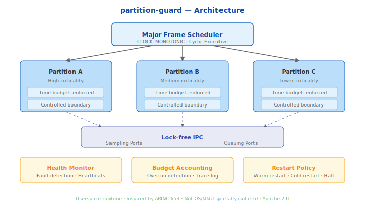

# partition-guard

**Userspace partition scheduler with temporal and spatial isolation.**

Inspired by ARINC 653 partitioned architectures, built for research, prototyping, and education. Demonstrates how multiple software partitions can share a CPU with controlled temporal boundaries — a core concept in Integrated Modular Avionics (IMA).

## What This Is

A cyclic executive that runs software partitions in fixed time windows with:

- **Temporal isolation** — each partition gets a controlled time budget, enforced via `CLOCK_MONOTONIC`
- **Budget enforcement** — overruns are detected within nanoseconds
- **Health monitoring** — automatic fault detection, partition restart, and system halt policies
- **Deterministic IPC** — lock-free sampling ports (latest-value) and queuing ports (bounded FIFO)
- **Full tracing** — binary trace log with nanosecond timestamps for post-run analysis

## What This Is NOT

- Not a certified RTOS
- Not ARINC 653 compliant
- Not a hypervisor
- Not for production flight software

This is a demonstration of partitioning concepts — the kind of thing you build to understand the problem before choosing VxWorks 653 or PikeOS.

## Quick Start

```bash
# Build
cmake -B build -DCMAKE_BUILD_TYPE=Release
cmake --build build -j$(nproc)

# Run (100 major frames, ~3 seconds)
./build/partition-guard 100

# Run with CPU pinning (better jitter)
sudo ./build/partition-guard 1000 --cpu 2

# Run tests
cd build && ctest --output-on-failure
```

## Demo Output

```
╔══════════════════════════════════════════════╗
║         partition-guard v0.1.0               ║
║   Userspace partition scheduler with         ║
║   temporal and spatial isolation             ║
╚══════════════════════════════════════════════╝

Schedule:
  Major frame: 30ms
  Partitions:  3
  Windows:     3

  Partition    Budget     Offset     Critical
  ---------    ------     ------     --------
  NAV          10         0          no
  SENSOR       5          10         YES
  DISPLAY      15         15         no

Running 100 major frames (3.0s expected)...

══════════════════════════════════════════════
Results:
  Major frames:    100
  Total runtime:   3.001s
  Total overruns:  0
  Worst jitter:    42μs

  Partition    Iters    Last(μs)   Worst(μs)  Avg(μs)    Overruns
  ---------    -----    --------   ---------  -------    --------
  NAV          100      5234       7891       5512       0
  SENSOR       100      2103       3987       2456       0
  DISPLAY      100      8901       11234      9123       0
══════════════════════════════════════════════
```

## Architecture



```
┌─────────────────────────────────────────────┐
│           Cyclic Executive Scheduler         │
│                                             │
│  ┌─────────┐ ┌─────────┐ ┌─────────┐       │
│  │  NAV    │ │ SENSOR  │ │ DISPLAY │       │
│  │ 0-10ms  │ │ 10-15ms │ │ 15-30ms │       │
│  └────┬────┘ └────┬────┘ └────┬────┘       │
│       │           │           │             │
│       └─────┬─────┘           │             │
│             ▼                 │             │
│     ┌──────────────┐          │             │
│     │ Sampling Port│◄─────────┘             │
│     │ (lock-free)  │                        │
│     └──────────────┘                        │
│                                             │
│  ┌──────────────┐  ┌──────────────────┐     │
│  │Health Monitor│  │ Trace Logger     │     │
│  │ overrun→warn │  │ binary, lock-free│     │
│  │ 3x→restart   │  │ 65536 records    │     │
│  │ 5x→halt      │  └──────────────────┘     │
│  └──────────────┘                           │
└─────────────────────────────────────────────┘
```

### Major Frame Schedule

```
|←─────────────── 30ms Major Frame ──────────────────→|
|  NAV (10ms)  | SENSOR (5ms) |    DISPLAY (15ms)     |
|──────────────|──────────────|───────────────────────|
0              10             15                      30
```

## IPC: Sampling & Queuing Ports

**Sampling ports** hold the latest value. Writers overwrite; readers always get the most recent data. No queue, no blocking, no allocation.

**Queuing ports** are bounded FIFOs. Fixed message size, fixed depth. SPSC (single producer, single consumer), lock-free.

```cpp
#include <pg/port.hpp>

// Sampling port: 64-byte messages
pg::SamplingPort<64> nav_output;
nav_output.write(&position, sizeof(position));  // producer
nav_output.read(&position, sizeof(position));   // consumer

// Queuing port: 128-byte messages, depth 16
pg::QueuingPort<128, 16> event_queue;
event_queue.enqueue(&event, sizeof(event));      // producer
event_queue.dequeue(&event, sizeof(event));      // consumer
```

## Health Monitoring

The health monitor tracks budget overruns per partition:

| Condition | Action |
|-----------|--------|
| Single overrun | Log warning |
| 3 consecutive overruns | Restart partition |
| 5 restarts exhausted (critical partition) | **Halt system** |
| 5 restarts exhausted (non-critical) | Log and skip |

Successful executions reset the consecutive overrun counter.

## Tracing

The scheduler emits binary trace records (32 bytes each) to a lock-free ring buffer. Events include:

- `MajorFrameStart` / `MajorFrameEnd`
- `PartitionStart` / `PartitionEnd` (with execution time)
- `BudgetOverrun` (with overrun amount)
- `HealthFault` / `HealthRestart`
- `PortWrite` / `PortRead`

Trace files can be analyzed with Python tooling (see `tools/`).

## Configuration

Default configuration runs 3 partitions in a 30ms major frame:

| Partition | Budget | Offset | Priority | Critical |
|-----------|--------|--------|----------|----------|
| NAV | 10ms | 0ms | 2 | No |
| SENSOR | 5ms | 10ms | 3 | Yes |
| DISPLAY | 15ms | 15ms | 1 | No |

Custom configurations via YAML are planned. Currently, modify `config.hpp` or create custom `ScheduleConfig` structs.

## Building

**Requirements:** Linux, CMake ≥ 3.25, GCC ≥ 13 or Clang ≥ 17

```bash
# Debug build with tests
cmake -B build -DCMAKE_BUILD_TYPE=Debug -DPG_BUILD_TESTS=ON
cmake --build build -j$(nproc)

# Release build with benchmarks
cmake -B build -DCMAKE_BUILD_TYPE=Release -DPG_BUILD_BENCH=ON
cmake --build build -j$(nproc)

# Run benchmarks
./build/bench_scheduler
./build/bench_ipc
```

## Design Decisions

- **No dynamic allocation after init** — all buffers are fixed-size, allocated at startup
- **No exceptions** — built with `-fno-exceptions` (real-time convention)
- **No RTTI** — built with `-fno-rtti` (real-time convention)
- **CLOCK_MONOTONIC** — immune to NTP adjustments
- **Lock-free IPC** — no mutexes in the data path
- **Stable, deterministic scheduling** — same config = same execution order every time
- **Userspace only** — no kernel modules, no root required (root helps for CPU pinning)

## Limitations

1. **Single-core only** — multi-core partitioning (CAST-32A) is a future goal
2. **No real spatial isolation** — partitions share an address space (use process isolation for production)
3. **No preemption** — partitions run to completion or overrun; no mid-window preemption
4. **Simulated workloads** — demo workloads are busy-wait loops, not real avionics code
5. **No YAML config yet** — configuration is compiled-in (planned for v0.2)

## References

- ARINC 653: Avionics Application Software Standard Interface (Part 1 — Required Services)
- CAST-32A: Multi-core Processors (FAA/EASA position paper)
- DO-178C: Software Considerations in Airborne Systems and Equipment Certification

## License

Apache-2.0
